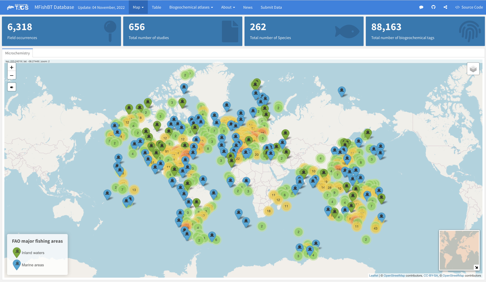

## *MFishBT* (*M*igratory *Fish*’s *B*iogeochemical *T*ags) Database 

### Summary

Humans have long been fascinated by the mysteries surrounding fish migrations, and addressing these puzzling migrations requires large datasets. Biogeochemical tags, including bulk elements and isotopic ratios, are the most accessible biomarkers for powerfully tracking fish migrations. However, standardized datasets on biogeochemical tags for migratory fish research are rarely available, which limits our understanding of the evolutionary origins, driving mechanisms, distribution, migration timing and routes of migratory fishes, as well as to develop conservation strategies and inform management actions. Here, we present **MFishBT**, a living, open and global database of **M**igratory **Fish**’s **B**iogeochemical **T**ags. Currently (November 2022), it contains biogeochemical records from 903 studies. Among them, 60% of the studies used element-to-calcium (E/Ca) ratios, 27% used isotopic ratios, and 13% used both tags. The database covers 10,665 field sampling sites (inland 49% vs. marine 51%) around the global major fishing areas and 346 migratory fishes belonging to 31 orders/suborders and 99 families. Seventy-five trace elements and 10 isotopes were detected across various biomineral archives of fish (e.g., otolith, scale, eye lenses and vertebra). E/Ca ratios were examined more frequently than isotopic ratios (64% vs. 36%), led by Sr/Ca, Mg/Ca, Ba/Ca and 87Sr/86Sr, δ13C, δ18O, respectively. The **MFishBT** comprises 5,494 geo-referenced records with biogeochemical element data detected in the edges of archived tissues. This is the most comprehensive open global database on biogeochemical tags in migratory fish to date, which can serve a variety of needs in scientific research, conservation and management of migratory fish. We encourage researchers to add more datasets to this database in the future. This database is released for non-commercial use only. There are no copyright restrictions, and please cite this paper when using these data, or a subset of these data, for publication.

Graphical user interface for [MFishBT](https://otoliths.github.io/MFishBT_shiny/index.html) database.

### Data Availability

The datasets and R scripts that support the findings of this study are openly available at [**here**](https://github.com/Otoliths/MFishBT_shiny/tree/main/paper_code). 

### Citation

Ding, L.D. et al., (202x). MFishBT: A global database of biogeochemical tags in migratory fish. (In preparation)

### Contribution

Adding new entries to the [**MFishBT**](https://otoliths.github.io/MFishBT_shiny/index.html) database (updated annually) is encouraged. Topright navbar of this database pull requests are the preferred means of making a contribution to the project.
